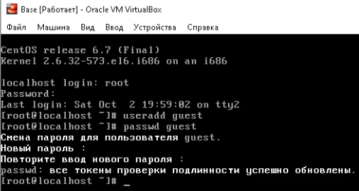
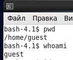
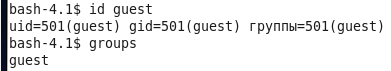
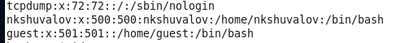
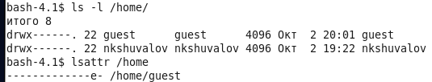
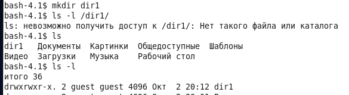
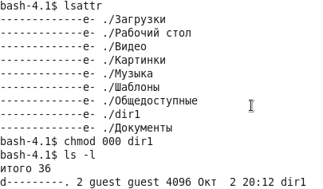
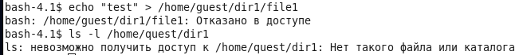

---
# Front matter
lang: ru-RU
title: "Отчёт по лабораторной работе №2"
subtitle: "Дискреционное разграничение прав в Linux. Основные атрибуты"
author: "Шувалов Николай  НФИбд-02-18"

# Formatting
toc-title: "Содержание"
toc: true # Table of contents
toc_depth: 2
lof: true # List of figures
fontsize: 12pt
linestretch: 1.5
papersize: a4paper
documentclass: scrreprt
polyglossia-lang: russian
polyglossia-otherlangs: english
mainfont: PT Serif
romanfont: PT Serif
sansfont: PT Sans
monofont: PT Mono
mainfontoptions: Ligatures=TeX
romanfontoptions: Ligatures=TeX
sansfontoptions: Ligatures=TeX,Scale=MatchLowercase
monofontoptions: Scale=MatchLowercase
indent: true
pdf-engine: lualatex
header-includes:
  - \linepenalty=10 # the penalty added to the badness of each line within a paragraph (no associated penalty node) Increasing the value makes tex try to have fewer lines in the paragraph.
  - \interlinepenalty=0 # value of the penalty (node) added after each line of a paragraph.
  - \hyphenpenalty=50 # the penalty for line breaking at an automatically inserted hyphen
  - \exhyphenpenalty=50 # the penalty for line breaking at an explicit hyphen
  - \binoppenalty=700 # the penalty for breaking a line at a binary operator
  - \relpenalty=500 # the penalty for breaking a line at a relation
  - \clubpenalty=150 # extra penalty for breaking after first line of a paragraph
  - \widowpenalty=150 # extra penalty for breaking before last line of a paragraph
  - \displaywidowpenalty=50 # extra penalty for breaking before last line before a display math
  - \brokenpenalty=100 # extra penalty for page breaking after a hyphenated line
  - \predisplaypenalty=10000 # penalty for breaking before a display
  - \postdisplaypenalty=0 # penalty for breaking after a display
  - \floatingpenalty = 20000 # penalty for splitting an insertion (can only be split footnote in standard LaTeX)
  - \raggedbottom # or \flushbottom
  - \usepackage{float} # keep figures where there are in the text
  - \floatplacement{figure}{H} # keep figures where there are in the text
---

# Цель работы

Получить практические навыки работы в консоли с атрибутами файлов, закрепить теоретические основы дискреционного разграничения доступа в современных системах с открытым кодом на базе ОС Linux.

# Выполнение лабораторной работы

1. В установленной при выполнении предыдущей лабораторной работы
операционной системе создал учётную запись пользователя guest (используя учётную запись администратора):

2. Задал  пароль для пользователя guest (использую учётную запись администратора):

{ #fig:001 width=70% }

3. Вошел в систему от имени пользователя guest.

4. Определил директорию, в которой я нахожусь, командой pwd. 

5. Уточнил имя пользователя командой whoami.

{ #fig:002 width=70% }

6. Уточнил имя пользователя, его группу, а также группы, куда входит пользователь, командой id. Выведенные значения uid, gid и др. запомнил. Сравнил вывод id с выводом команды groups.

7. Сравнил полученную информацию об имени пользователя с данными, выводимыми в приглашении командной строки.

{ #fig:003 width=70% }

8. Просмотрел файл /etc/passwd командой
cat /etc/passwd

{ #fig:004 width=70% }]

 #fig:005 width=70% }

9. Определил существующие в системе директории командой
ls -l /home/

10. Проверил, какие расширенные атрибуты установлены на поддиректориях, находящихся в директории /home, командой:
lsattr /home

{ #fig:006 width=70% }

11. Создал в домашней директории поддиректорию dir1 командой
mkdir dir1
Определил командами ls -l и lsattr, какие права доступа и расширенные атрибуты были выставлены на директорию dir1.

{ #fig:007 width=70% }

12. Снял с директории dir1 все атрибуты командой
chmod 000 dir1
и проверил с её помощью правильность выполнения команды
ls -l

{ #fig:008 width=70% }

13. Попытался создать в директории dir1 файл file1 командой
echo "test" > /home/guest/dir1/file1

{ #fig:009 width=70% }

# Вывод

Получили практические навыки работы в консоли с атрибутами файлов, закрепили теоретические основы дискреционного разграничения доступа в современных системах с открытым кодом на базе ОС Linux.
